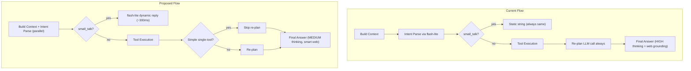

# Chat Latency Reduction and Dynamic Small Talk

## Current Problem

The chat pipeline has ~5-15s end-to-end latency due to serial LLM calls with HIGH thinking, aggressive web grounding, per-call client instantiation, and unnecessary re-plan rounds. Small talk returns the same static string every time.

## Architecture: Current vs. Proposed Flow




---

## Part 1: Latency Reduction

### 1A. Lower thinking level (instant win, ~2-5s saved)

**File:** [.env](.env)

Change `GEMINI_THINKING_LEVEL=HIGH` to `GEMINI_THINKING_LEVEL=MEDIUM`. This is the single biggest win -- HIGH thinking adds substantial internal chain-of-thought before the first output token. MEDIUM still provides good reasoning quality for finance Q&A.

Also update [.env.example](.env.example) to match.

### 1B. Cache the Gemini client instance (~200-500ms saved per request)

**File:** [services/ai/chat/gemini_stream_client.py](services/ai/chat/gemini_stream_client.py)

Currently `genai.Client(api_key=...)` is created on every call in both `_sync_generate_text` (line 136) and the `_worker` in `stream_answer` (line 170). Each instantiation creates new HTTP connections.

- Import `google.genai` at module level (or lazily once)
- Create the client once in `__init__` and store as `self._client`
- Pass `self._client` into both `_sync_generate_text` and the streaming worker via a closure
- The worker thread can safely use the client since `genai.Client` uses `httpx` under the hood which is thread-safe for separate calls

### 1C. Parallelize context assembly and intent parsing (~500ms saved)

**File:** [services/ai/chat/chat_orchestrator.py](services/ai/chat/chat_orchestrator.py)

Currently in `stream_sse`, Steps 1 (build system prompt) and Step 3 (intent parse) run sequentially, but they are independent. The intent parser only needs `conversation_text`, `context_text`, and `last_user` -- none of which depend on the full system prompt.

- Wrap `build_system_prompt(...)` in `asyncio.to_thread(...)` (it does a DB query)
- Run it in parallel with `self.intent_parser.parse(...)` using `asyncio.gather`
- This overlaps the ~100ms DB call with the ~500-1500ms intent parse LLM call

### 1D. Skip re-plan for simple single-tool intents (~500-1500ms saved)

**File:** [services/ai/chat/chat_orchestrator.py](services/ai/chat/chat_orchestrator.py)

After a tool executes in the ReAct loop (line 337-355), there's always a re-plan call to flash-lite to check if another tool is needed. For simple intents like `quote_lookup`, `company_profile`, `fundamentals` where one Tier-1 tool was called and succeeded, re-planning is wasteful.

- Define a set of "single-tool intents": `{"quote_lookup", "company_profile", "fundamentals"}`
- After the first tool succeeds for these intents, break out of the loop directly without re-planning
- Keep re-plan behavior for complex intents (`portfolio_analysis`, `symbol_analysis`, `peer_comparison`, `risk_analysis`) where chained tools are useful

### 1E. Smart web grounding: skip when tools already fetched live data (~1-3s saved)

**File:** [services/ai/chat/chat_orchestrator.py](services/ai/chat/chat_orchestrator.py)

When the tool loop fetched fresh data (Tier-1 real-time quotes, Tier-2 cached analysis), web grounding in the final answer is redundant -- the tools already provide current data.

- After the tool loop, if `tool_results` is non-empty and all results have `ok=True`, set `computed_allow_web = False`
- Only keep web grounding when: no tools were called, or the intent specifically benefits from web context (e.g., `macro_news`)
- Add a set of "web-preferred intents": `{"macro_news"}` that always keep web grounding

---

## Part 2: Dynamic Small Talk

### 2A. Add small talk prompt and env config

**File:** [services/ai/chat/chat_prompts.py](services/ai/chat/chat_prompts.py)

Add a new prompt constant:

```python
SMALL_TALK_SYSTEM_PROMPT = """You are a friendly, witty finance assistant named WealthStreet AI.
Respond naturally and conversationally to the user's casual message.
Subtly mention one capability you have (stocks, portfolio analysis, market data, risk analysis).
Keep it to 1-2 sentences. Be warm but not corny. Vary your responses."""
```

**File:** [.env](.env) and [.env.example](.env.example)

Add `GEMINI_SMALL_TALK_MODEL=gemini-2.0-flash-lite` (same model as intent parser -- extremely fast, ~200-500ms).

### 2B. Add a quick generate method to GeminiStreamClient

**File:** [services/ai/chat/gemini_stream_client.py](services/ai/chat/gemini_stream_client.py)

Add a new lightweight method `quick_generate` that:

- Uses the cached client from change 1B
- Takes a `model_override` parameter (for the lite model)
- Calls `generate_content` (non-streaming, since small talk is 1-2 sentences)
- Has a tight timeout (~2s)
- Disables thinking (flash-lite doesn't support it anyway) and web grounding

This is similar to `decide_tool_action` but without JSON parsing -- just returns raw text.

### 2C. Replace static small talk in orchestrator

**File:** [services/ai/chat/chat_orchestrator.py](services/ai/chat/chat_orchestrator.py)

Replace the current `_small_talk_response` method (lines 90-94) and the small talk fast path block (lines 195-209):

- Make `_small_talk_response` async, accepting `last_user_message` as a parameter
- Inside, call `self.gemini.quick_generate(...)` with the small talk prompt and the user's message, using the lite model from env
- Add a fallback: if the lite call fails or times out, return a static fallback string (keep the current one as a safety net)
- The rest of the SSE emission logic (heartbeat, token, done) stays the same

### 2D. Read the small talk model from env

**File:** [services/ai/chat/chat_orchestrator.py](services/ai/chat/chat_orchestrator.py)

In `__init__`, read `GEMINI_SMALL_TALK_MODEL` from env (defaulting to `gemini-2.0-flash-lite`) and store it for use in the small talk path.

---

## Expected Impact

- **Thinking level change**: ~2-5s saved on every request (biggest win)
- **Client caching**: ~200-500ms saved (compounding across 2-4 Gemini calls per request)
- **Parallel context + intent**: ~500ms saved
- **Skip re-plan**: ~500-1500ms saved on simple queries
- **Smart web grounding**: ~1-3s saved on tool-assisted queries
- **Dynamic small talk**: Same ~300-500ms latency as current static path, but responses are now varied and contextual

