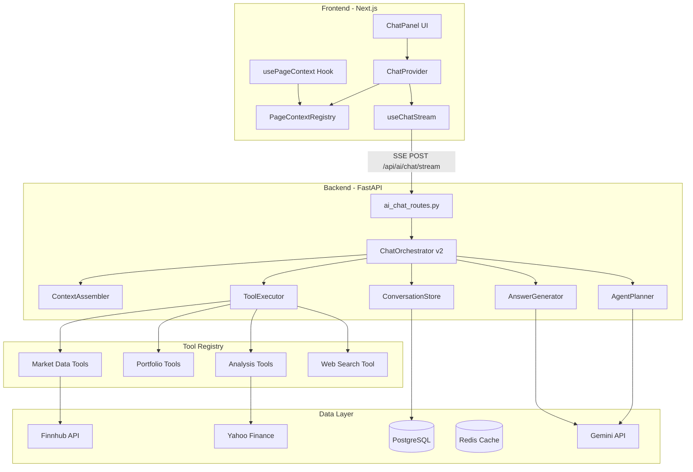
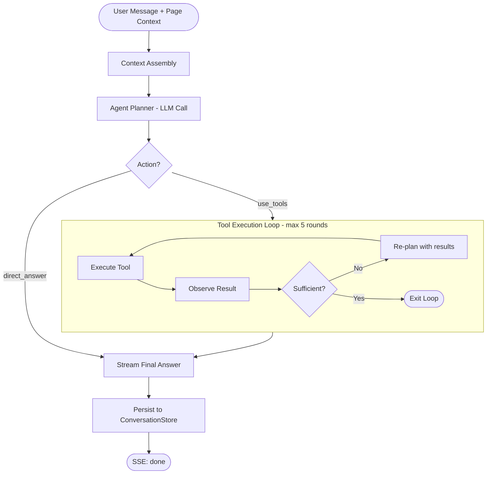
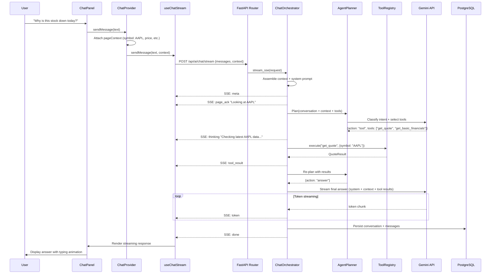

# WealthStreet AI Chat Agent -- System Architecture

## 1. Current State Assessment

The existing system has a functional but limited chat pipeline:

- **Backend:** Single intent classification -> single tool call -> streamed Gemini answer
- **Frontend:** SSE streaming with typing animation, `ChatProvider` wraps all protected pages
- **Gaps:** No page context passed, no conversation persistence, no multi-step reasoning, limited tool set (6 Finnhub tools), tool loop breaks after 1 round despite `max_tool_rounds=2`

---

## 2. Target Architecture Overview




---

## 3. Page Context System

### 3A. Frontend: Context Collection

Create a `usePageContext` hook that each page calls to register its context with `ChatProvider`. The context is automatically included in every chat request.

**New file:** `hooks/usePageContext.ts`

```typescript
type PageType = "dashboard" | "symbol" | "holdings" | "market" | "analytics" | "settings" | "unknown";

type PageContext = {
  pageType: PageType;
  route: string;
  symbol?: string;          // on symbol pages
  summary?: string;         // human-readable summary of visible data
  dataSnapshot?: Record<string, unknown>; // structured subset of page data
  timestamp: number;
};
```

**Integration points by page:**

- **Dashboard** (`/dashboard`): Portfolio value, day P/L, top 5 holdings, health score, allocations
- **Symbol** (`/dashboard/symbol/[symbol]`): Symbol, current price, day change, key ratios (PE, PB, beta), AI verdict if loaded, active tab
- **Holdings** (`/holdings`): Total holdings count, total value, active filters, visible symbols list
- **Market** (`/dashboard/market`): Major indices values, market sentiment, sector movers

**Key design choice:** Send a *compressed summary* (max ~2000 chars), not raw data objects. This keeps token costs low and context relevant.

### 3B. Backend: Context Processing

Extend `[ChatContext](services/ai/chat/chat_models.py)` to accept page context:

```python
class PageContext(BaseModel):
    page_type: str
    route: str
    symbol: Optional[str] = None
    summary: Optional[str] = Field(default=None, max_length=3000)
    data_snapshot: Optional[Dict[str, Any]] = None

class ChatContext(BaseModel):
    portfolio_summary: Optional[str] = None
    risk_profile: Optional[str] = None
    preferred_currency: Optional[str] = None
    page: Optional[PageContext] = None          # NEW
```

The `ContextAssembler` loads the user's `UserOnboardingProfile` server-side (via the already-authenticated `user_id`) and injects it into the system prompt. This avoids sending sensitive profile data from the frontend. The profile is already loaded this way in `analyze_portfolio_aggregator.py` (line 345-353) and contains:

- `risk_level` (low / medium / high)
- `time_horizon` (short / medium / long)
- `primary_goal` (growth / income / preserve / save_for_goal)
- `experience_level` (beginner / intermediate / advanced)
- `age_band`, `country`, `asset_preferences`, `style_preference`

The assembler queries `UserOnboardingProfile` once per request and formats it as a system prompt layer, so the LLM knows:

- What page the user is viewing
- What data is visible on screen
- The user's investor profile (risk tolerance, goals, experience) for personalized tone and advice
- The user's preferred currency

---

## 4. Agentic Orchestration (ReAct Loop)

Replace the current linear intent -> tool -> answer flow with a proper **ReAct** (Reason-Act-Observe) loop in `[ChatOrchestrator](services/ai/chat/chat_orchestrator.py)`.




### Key changes to `ChatOrchestrator`:

1. **Increase `max_tool_rounds` from 2 to 5** and remove the `break` on line 242 that currently exits after 1 tool call
2. **After each tool result, re-invoke the planner** with accumulated tool results to decide next action
3. **Parallel tool execution** when tools are independent (e.g., `get_quote("AAPL")` + `get_quote("MSFT")` simultaneously)
4. **Emit `thinking` SSE events** so the frontend can show "Analyzing your portfolio..." / "Looking up AAPL fundamentals..."

### Agent Planner prompt structure:

```
System: You are a finance agent planner. Given the conversation, page context, 
        and any tool results so far, decide the next action.

Available tools: [expanded tool manifest]

Page context: User is on the AAPL symbol page. Visible: price $198.50, 
              PE 32.1, day change -1.2%, AI verdict: Bullish.

Conversation: [history]
Tool results so far: [accumulated results]

Decide: { action: "tool" | "answer", tools: [...], reasoning: "..." }
```

---

## 5. Expanded Tool Registry

Organize tools into tiers by latency and purpose. New tools leverage existing backend services that are already built but not connected to chat.

### Tier 1: Real-time Data (< 2s)


| Tool                                      | Source       | Already Exists |
| ----------------------------------------- | ------------ | -------------- |
| `get_quote(symbol)`                       | Finnhub      | Yes            |
| `get_company_profile(symbol)`             | Finnhub      | Yes            |
| `get_basic_financials(symbol)`            | Finnhub      | Yes            |
| `get_peers(symbol)`                       | Finnhub      | Yes            |
| `get_portfolio_overview(currency, top_n)` | DB + Finnhub | Yes            |
| `get_portfolio_position(symbol)`          | DB + Finnhub | Yes            |


### Tier 2: Analysis (2-8s, cached)


| Tool                          | Source                           | Already Exists                      |
| ----------------------------- | -------------------------------- | ----------------------------------- |
| `get_symbol_analysis(symbol)` | `analyze_stock()`                | Service exists, tool wrapper needed |
| `get_portfolio_analysis()`    | `analyze_portfolio()`            | Service exists, tool wrapper needed |
| `get_risk_metrics(symbol)`    | `fetch_symbol_risk_metrics()`    | Service exists, tool wrapper needed |
| `get_portfolio_risk()`        | `fetch_portfolio_risk_metrics()` | Service exists, tool wrapper needed |


### Tier 3: Comparison (3-10s)


| Tool                         | Source                     | Already Exists |
| ---------------------------- | -------------------------- | -------------- |
| `compare_symbols(symbols[])` | Multi-quote + fundamentals | New            |


### Tier 4: Web (5-15s)


| Tool                | Source                      | Already Exists          |
| ------------------- | --------------------------- | ----------------------- |
| `web_search(query)` | Google grounding via Gemini | Yes (built into Gemini) |


**Implementation:** Extend `[FinnhubToolRegistry](services/ai/chat/finnhub_tools.py)` into a more general `ChatToolRegistry` that accepts additional service dependencies:

```python
class ChatToolRegistry:
    def __init__(
        self,
        finnhub: FinnhubService,
        db: Session,
        user_id: int,
        analysis_service: AnalyzeSymbolService, # NEW: for stock analysis
        portfolio_analysis: AnalyzePortfolioService, # NEW
    ):
        ...
```

---

## 6. Conversation Persistence

### New database models

**New file:** `models/conversation.py`

```python
class Conversation(Base):
    __tablename__ = "conversations"
    id = Column(String(128), primary_key=True)
    user_id = Column(Integer, ForeignKey("users.id"), nullable=False, index=True)
    title = Column(String(200))
    page_context_type = Column(String(50))  # last page type for resumability
    created_at = Column(DateTime, server_default=func.now())
    updated_at = Column(DateTime, onupdate=func.now())

class ConversationMessage(Base):
    __tablename__ = "conversation_messages"
    id = Column(String(128), primary_key=True)
    conversation_id = Column(String(128), ForeignKey("conversations.id"), index=True)
    role = Column(String(20))     # user | assistant | tool_call | tool_result
    content = Column(Text)
    metadata_ = Column("metadata", JSONB)  # tool name, page context, latency, etc.
    created_at = Column(DateTime, server_default=func.now())
```

### Persistence flow:

1. On first message, create `Conversation` record
2. After each user message and assistant response, write `ConversationMessage` records
3. Tool calls and results stored as separate messages (role: `tool_call`, `tool_result`)
4. Auto-generate conversation title from first user message via LLM

### Benefits:

- Resume conversations across sessions
- Analytics on common questions and tool usage
- Training data for fine-tuning

---

## 7. SSE Protocol Enhancement

Extend the SSE event types in `[chat_models.py](services/ai/chat/chat_models.py)` for richer frontend feedback:

**Current events:** `meta`, `tool_call`, `tool_result`, `token`, `done`, `error`, `heartbeat`

**New events:**

- `thinking` -- Agent reasoning step (e.g., "I need to look up AAPL financials and compare with peers")
- `page_ack` -- Acknowledges page context ("I can see you're looking at AAPL")
- `plan` -- Shows tool execution plan to user
- `citation` -- Source attribution for claims

Frontend `useChatStream.ts` handles new events:

- `thinking` -> show subtle "Analyzing..." indicator with reasoning text
- `page_ack` -> brief context acknowledgment in UI
- `plan` -> show tool execution plan as status chips

---

## 8. Frontend Integration

### 8A. ChatProvider Changes (`[ChatProvider.tsx](components/chat/ChatProvider.tsx)`)

```typescript
// New: PageContextRegistry
const [pageContext, setPageContext] = useState<PageContext | null>(null);

// usePageContext hook updates this from any page
const registerPageContext = useCallback((ctx: PageContext) => {
  setPageContext(ctx);
}, []);

// sendMessage now includes page context
const sendMessage = useCallback(async (text: string) => {
  const request = {
    messages: [...history, { role: "user", content: text }],
    context: {
      preferred_currency: user?.currency,
      page: pageContext ? {
        page_type: pageContext.pageType,
        route: pageContext.route,
        symbol: pageContext.symbol,
        summary: pageContext.summary,
      } : undefined,
    },
  };
  await originalSendMessage(text, request.context);
}, [originalSendMessage, pageContext, user]);
```

### 8B. useChatStream Changes (`[useChatStream.ts](hooks/useChatStream.ts)`)

- Accept `context` parameter in `sendMessage` and include it in the POST body
- Handle new SSE event types (`thinking`, `page_ack`, `plan`)
- Expose `thinkingText` state for UI rendering

### 8C. Page Integration Example (Symbol page)

```typescript
// In components/investment/index.tsx
usePageContext({
  pageType: "symbol",
  route: pathname,
  symbol: symbol,
  summary: `Viewing ${symbol} at $${quote?.current_price}. Day: ${quote?.day_change_pct}%. PE: ${quote?.pe_ratio}. ${insights?.valuationBadge || ""}. ${analysis?.verdict || ""}`,
});
```

---

## 9. System Prompt Architecture

Dynamic system prompt assembled from layers:

```
Layer 1: Base persona (existing build_finance_system_prompt())
Layer 2: Tool manifest (expanded for all tool tiers)
Layer 3: Page context injection
  "The user is currently viewing the AAPL stock page. 
   Visible data: Price $198.50, PE 32.1, Day -1.2%.
   AI Verdict: Bullish (loaded). Active tab: Financials."
Layer 4: User profile (loaded server-side from UserOnboardingProfile)
  "Investor profile: risk_level=medium, time_horizon=long, 
   primary_goal=growth, experience_level=intermediate,
   style=hands_on, country=US."
Layer 5: Behavioral rules
  "When the user asks about 'this stock' or 'this chart', 
   refer to the symbol from page context.
   When discussing portfolio, fetch latest data via tools."
```

---

## 10. Request Flow (End-to-End)




---

## 11. File Change Summary

### Backend (InvestmentsBackend)

- **Modify** `[services/ai/chat/chat_models.py](services/ai/chat/chat_models.py)` -- Add `PageContext`, extend `ChatContext`, new SSE event types
- **Modify** `[services/ai/chat/chat_orchestrator.py](services/ai/chat/chat_orchestrator.py)` -- ReAct loop, multi-tool rounds, context assembly, conversation persistence
- **Modify** `[services/ai/chat/chat_prompts.py](services/ai/chat/chat_prompts.py)` -- Dynamic prompt layers, expanded tool manifest, page-context prompt injection
- **Modify** `[services/ai/chat/intent_parser.py](services/ai/chat/intent_parser.py)` -- Page-aware intent classification, multi-tool planning output
- **Modify** `[services/ai/chat/finnhub_tools.py](services/ai/chat/finnhub_tools.py)` -- Rename to `tool_registry.py`, add analysis/risk tool wrappers
- **Modify** `[routers/ai_chat_routes.py](routers/ai_chat_routes.py)` -- Inject new service dependencies (analysis services)
- **Create** `models/conversation.py` -- Conversation + ConversationMessage models
- **Create** `services/ai/chat/context_assembler.py` -- System prompt builder from page context + user profile
- **Create** Alembic migration for conversations tables

### Frontend (InvestmentsFrontend)

- **Create** `hooks/usePageContext.ts` -- Page context registration hook
- **Modify** `[components/chat/ChatProvider.tsx](components/chat/ChatProvider.tsx)` -- PageContextRegistry, context injection into requests
- **Modify** `[hooks/useChatStream.ts](hooks/useChatStream.ts)` -- Accept context param, handle new SSE events
- **Modify** `[types/chat.ts](types/chat.ts)` -- Extend ChatRequest with PageContext type
- **Modify** `[lib/chatApi.ts](lib/chatApi.ts)` -- Pass context in request body
- **Modify** page components (dashboard, symbol, holdings, market) -- Call `usePageContext` with page-specific data

---

## 12. Phased Rollout

- **Phase 1:** Page context system (frontend context collection + backend context injection)
- **Phase 2:** Expanded tool registry (wire existing analysis services as chat tools)
- **Phase 3:** ReAct agentic loop (multi-step reasoning, re-planning after tool results)
- **Phase 4:** Conversation persistence (DB models, save/load conversations)
- **Phase 5:** Enhanced SSE events (thinking, plan, citations) + frontend UI for them

